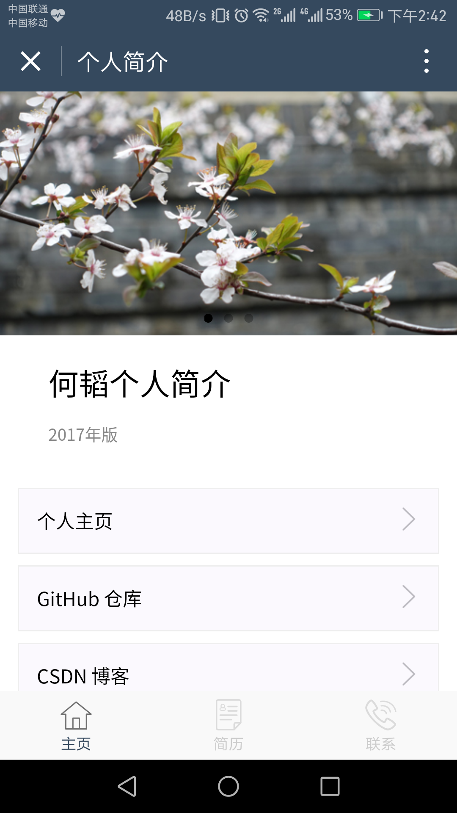
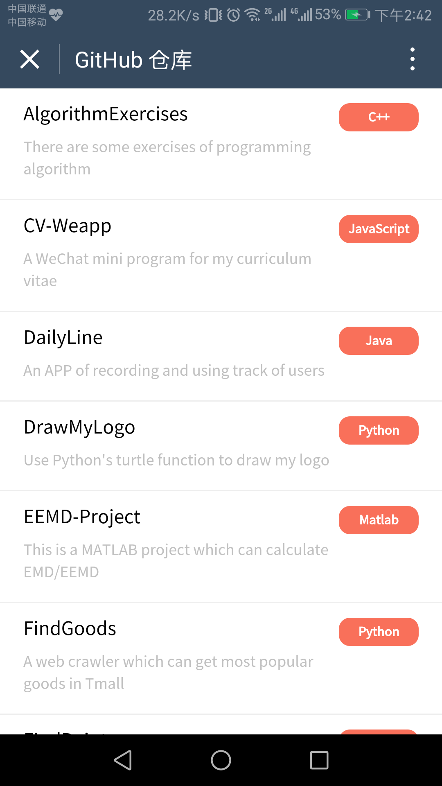

CV-Weapp
========
This is a WeChat mini program for my curriculum vitae, including my GitHub, CSDN blog, personal homepage and so on.

Now you can input “KTCV” in WeChat to get this mini program.

